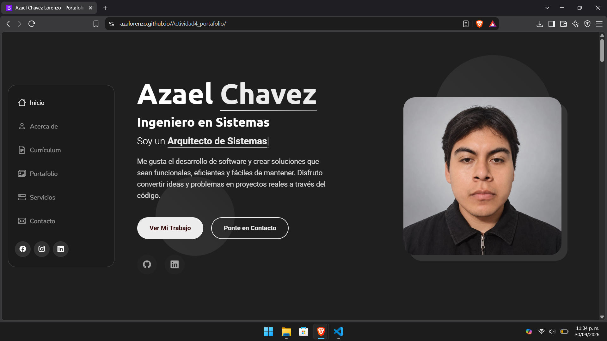
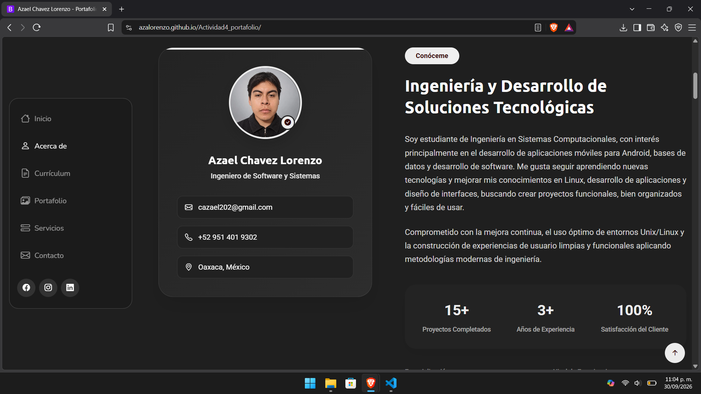
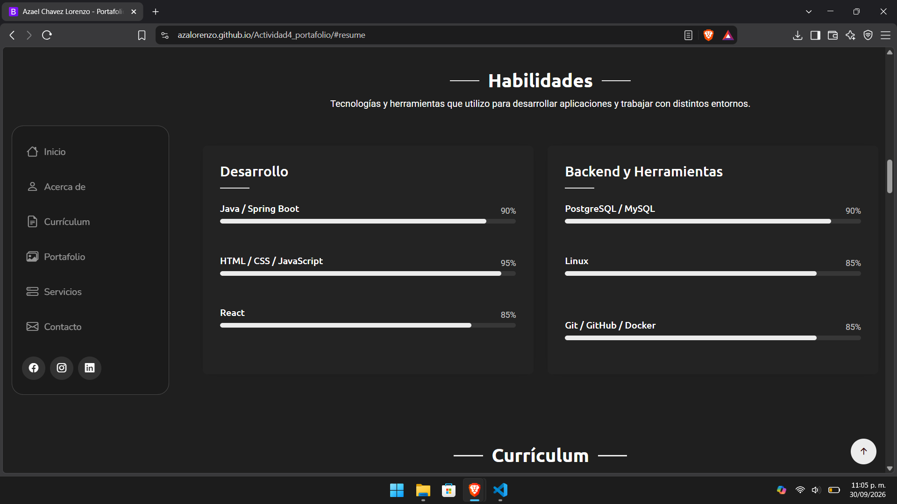
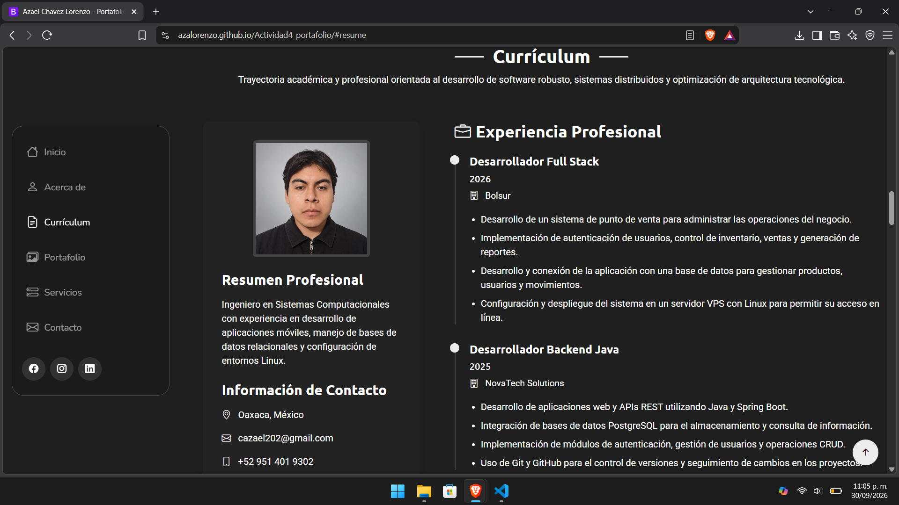
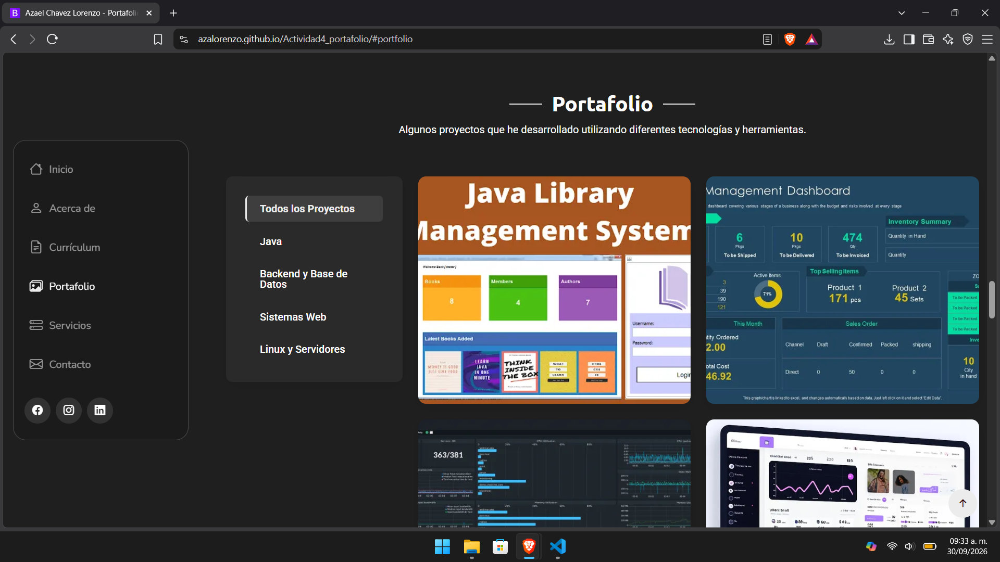
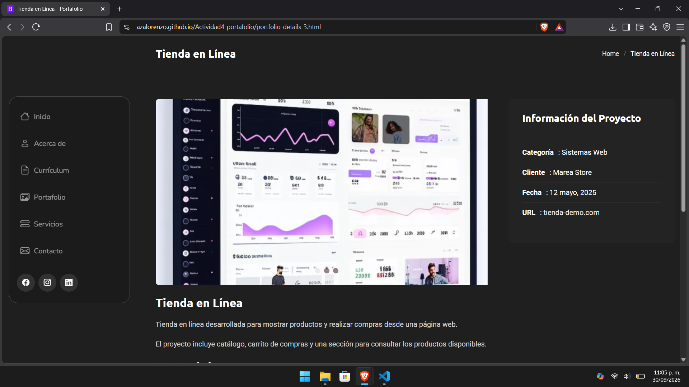
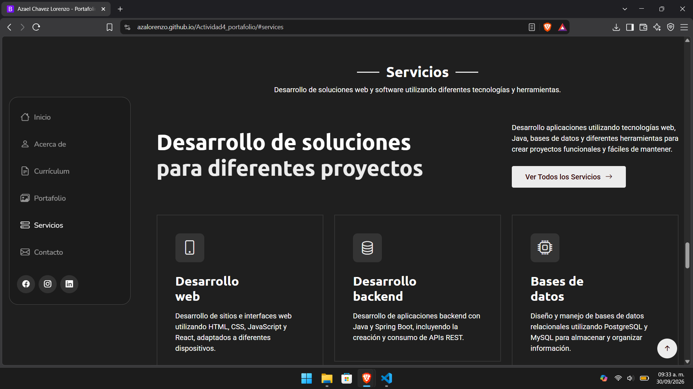
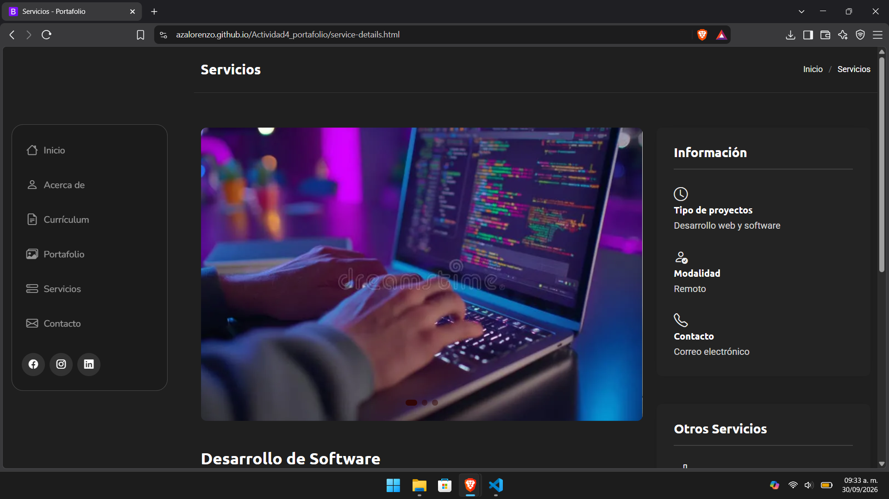
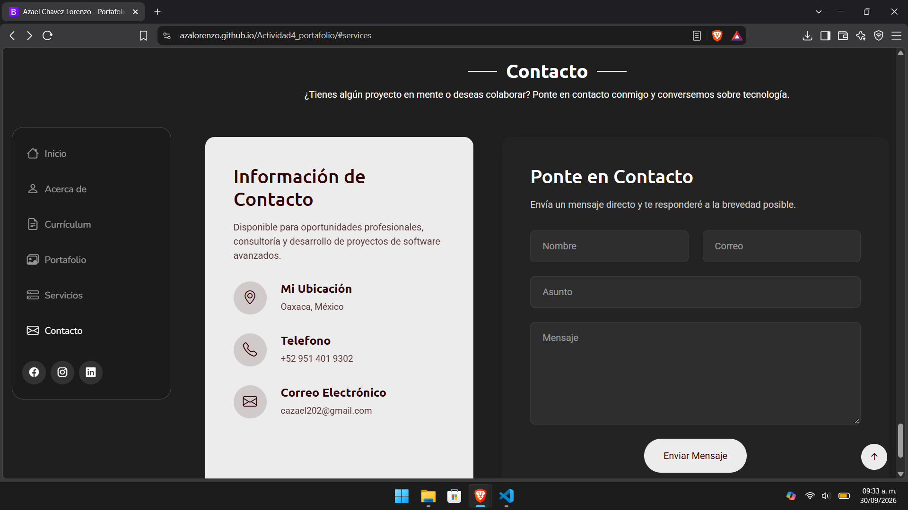

# Portafolio Personal

**Nombre:** Azael Chavez Lorenzo  
**Materia:** Programación Web

## Descripción

Este proyecto consiste en la creación de un portafolio personal utilizando una plantilla de Bootstrap como base.

Para realizarlo utilicé la plantilla **SnapFolio** de BootstrapMade. La plantilla original se encuentra en inglés, por lo que una de las primeras modificaciones fue traducir su contenido al español y después adaptar las diferentes secciones con información propia.

El objetivo fue tomar una plantilla ya existente y personalizarla para crear un portafolio relacionado con mi perfil como estudiante de Ingeniería en Sistemas Computacionales y el área de desarrollo de software.

## Plantilla utilizada

El proyecto utiliza **Bootstrap 5** como framework CSS.

La plantilla utilizada fue:

**SnapFolio - Bootstrap Portfolio Template**

Página de la plantilla:

https://bootstrapmade.com/snapfolio-bootstrap-portfolio-template/

Además de Bootstrap, la plantilla incluye algunas librerías para animaciones, galerías y otros elementos visuales.

## Secciones del portafolio

El portafolio está dividido en diferentes secciones:

### Inicio

Es la primera sección de la página. Contiene mi nombre, una pequeña presentación, una fotografía personal y botones para acceder al portafolio y a la sección de contacto.

También se agregaron enlaces a GitHub y LinkedIn.

### Acerca de

Contiene una descripción más completa sobre mí, mis intereses dentro de la carrera y algunas áreas en las que me interesa seguir desarrollándome.

También muestra información como educación, especialización, idiomas y algunos datos generales.

### Estadísticas

Se mantuvo una sección de estadísticas de la plantilla, pero se modificaron los datos originales para adaptarlos al portafolio.

En esta parte se muestran datos como clientes, proyectos realizados y horas de soporte.

### Habilidades

En esta sección se cambiaron las habilidades que incluía originalmente la plantilla y se agregaron tecnologías relacionadas con el perfil del portafolio.

Algunas de ellas son:

- Java y Spring Boot
- HTML, CSS y JavaScript
- React
- PostgreSQL y MySQL
- Linux
- Git, GitHub y Docker

### Currículum

Esta sección contiene información académica, experiencia, certificaciones y competencias principales.

También se modificaron los textos y las barras de habilidades para que coincidieran con las tecnologías utilizadas en el resto del portafolio.

### Portafolio

Se agregaron diferentes proyectos para mostrar ejemplos de los trabajos realizados.

Entre los proyectos se encuentran:

- Sistema de Biblioteca
- Sistema de Inventario
- Monitor de Servidor Linux
- Tienda en Línea
- Analizador Léxico en Java
- Panel de Administración Web

Los proyectos están separados por categorías y cada uno cuenta con una página donde se puede consultar más información.

### Servicios

En esta sección se muestran algunos servicios relacionados con las tecnologías incluidas en el portafolio, como desarrollo web, backend, bases de datos, aplicaciones Full Stack, Linux, servidores, Git y Docker.

También se modificó la página de detalles de servicios que incluía la plantilla, el contenido original fue reemplazado por información relacionada con desarrollo de software y las tecnologías mostradas en el portafolio.

### Testimonios

Se conservó la sección de testimonios que forma parte del diseño de la plantilla y se adaptaron algunos de sus textos.

### Contacto

Finalmente, se encuentra una sección con información de contacto y un formulario para enviar mensajes.

## Proceso de creación

Para realizar el portafolio se siguieron los siguientes pasos:

1. Primero se descargó la plantilla **SnapFolio** de BootstrapMade.

2. Se revisó la estructura de archivos de la plantilla para identificar el HTML principal, los estilos, scripts, imágenes y demás recursos.

3. Como la plantilla original estaba en inglés, se tradujeron al español los menús, títulos, botones y diferentes textos de la página.

4. Después se comenzó a reemplazar la información de ejemplo de la plantilla por información relacionada con mi perfil.

5. Se modificó la sección de inicio agregando mi nombre, una descripción y una fotografía personal.

6. También se revisaron los botones de redes sociales que incluía la plantilla. Algunos fueron eliminados debido a que no cuento con una cuenta en esas plataformas, dejando solamente las redes que utilizo actualmente, como GitHub, LinkedIn, Facebook e Instagram.

7. En la sección "Acerca de" se cambió la información original por una presentación personal y datos relacionados con mis estudios e intereses.

8. Se modificaron las habilidades para agregar tecnologías como Java, Spring Boot, HTML, CSS, JavaScript, React, PostgreSQL, MySQL, Linux, Git, GitHub y Docker.

9. También se modificó la sección del currículum agregando información académica, experiencia, certificaciones y competencias.

10. La sección de portafolio fue modificada para agregar diferentes proyectos. También se cambiaron las imágenes, nombres, categorías y páginas de detalles de cada proyecto.

11. Para los proyectos se crearon diferentes archivos de detalles a partir de la página que incluía originalmente la plantilla. En cada archivo se cambió la información y las imágenes para que correspondieran con el proyecto seleccionado.

12. Se modificó la sección de servicios para relacionarla con las tecnologías y conocimientos mostrados en el portafolio.

13. También se editó la página de detalles de servicios que venía incluida con la plantilla. Esta página todavía conservaba el contenido original en inglés relacionado con marketing digital, por lo que se reemplazó por información sobre desarrollo web, backend, bases de datos, Linux, servidores, Git y Docker.

14. Se cambiaron las imágenes de la página de servicios por otras relacionadas con programación para que fueran relacionadas con el contenido del portafolio.

15. También se realizaron algunos cambios pequeños en el CSS, por ejemplo, después de eliminar uno de los elementos de estadísticas se cambió la distribución de cuatro a tres columnas para mantener los elementos centrados.

16. Finalmente se revisaron los textos, enlaces, imágenes y diferentes secciones para mantener el mismo diseño de la plantilla, pero con contenido personalizado.

## Tecnologías utilizadas

- HTML5
- CSS3
- JavaScript
- Bootstrap 5
- Bootstrap Icons

También se utilizan las librerías que vienen incluidas con la plantilla para algunas animaciones y elementos visuales.

## Capturas de pantalla

A continuación se muestran algunas capturas del resultado final del portafolio.

### Página de inicio

### Acerca de

### Habilidades

### Currículum

### Portafolio

### Detalles de proyecto

### Servicios

### Detalles de servicios

### Contacto

## Resultado

El resultado final es un portafolio web responsivo basado en una plantilla de Bootstrap, pero modificado tanto en contenido como en algunas partes de su estructura para adaptarlo a un perfil personal, la mayor parte del diseño visual original se conservó, ya que el objetivo de la actividad fue trabajar a partir de una plantilla existente y aprender a identificar y modificar sus diferentes componentes.
